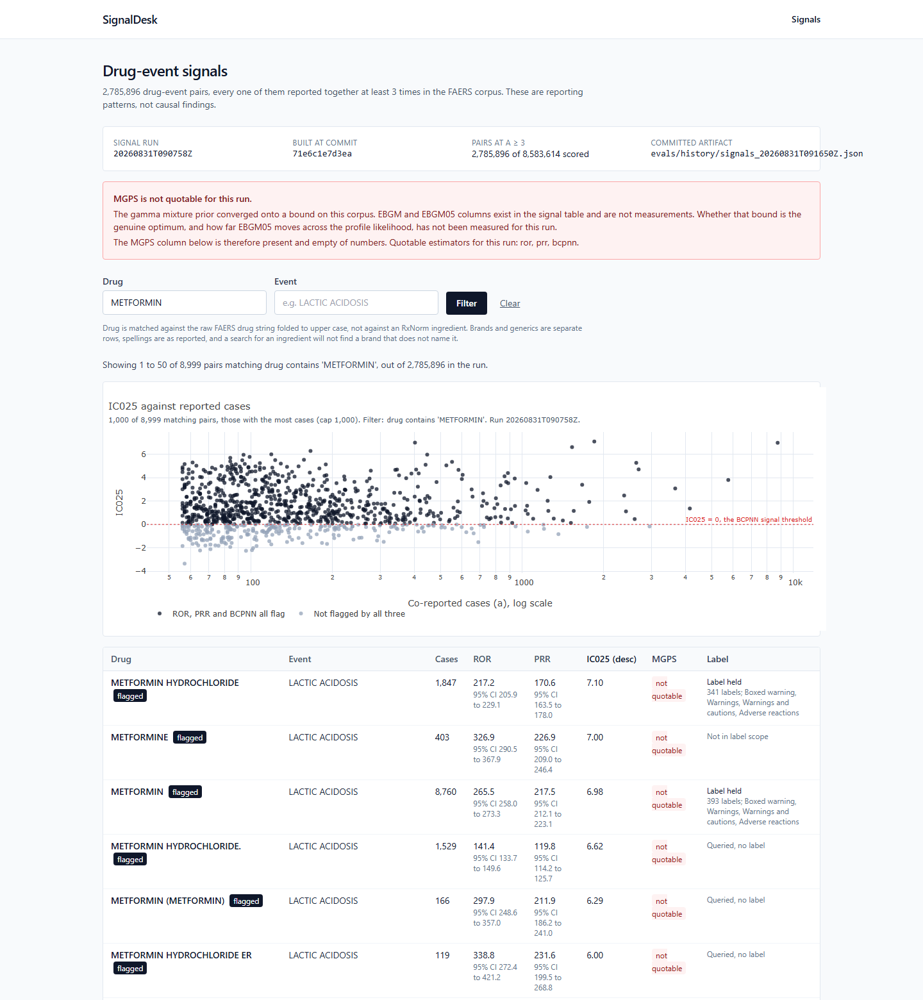

# SignalDesk

Post-market drug safety signal intelligence over the FDA adverse event data.

SignalDesk answers one question: for a given drug and adverse event, is this
reporting pattern already known, or is it worth a reviewer's time? It ingests the
full FAERS corpus, deduplicates it, computes the standard pharmacovigilance
disproportionality statistics over every drug-event pair, and is designed to
adjudicate each candidate against the drug's own FDA label, so that a signal
already described in the label can be separated from one that is not.

The ingest and statistics halves are built and measured. The retrieval and
adjudication halves are designed and not built. This README says which is which
at every point, and every number in it traces to a committed artifact under
`evals/history/`.

## Disproportionality is hypothesis-generating, not causal

Disproportionality statistics quantify reporting patterns in a voluntary
database. They do not establish that a drug caused an event. Reporting is
affected by publicity, litigation, time on market, and indication, none of which
are causal mechanisms. Every screen produced here is a hypothesis for a reviewer
to assess.

This is enforced rather than disclaimed: generated text that asserts causation is
treated as a defect that fails evaluation, not as a wording preference.

## What is built and measured

**FAERS ingest and deduplication.** All 55 quarterly extracts, 2012Q4 through
2026Q2. Resumable and idempotent, keyed on a manifest table, so a re-run never
duplicates rows.

**Disproportionality over the full corpus.** ROR, PRR, BCPNN IC025 and MGPS
EBGM05, as pure vectorized NumPy functions on `(a, b, c, d)` with no I/O and no
Python loops over pairs. Contingency tables are built in DuckDB over Parquet
across the whole corpus rather than over a sample.

From signal run `20260831T090758Z`:

| Measure | Value |
| --- | --- |
| Quarters ingested | 55 (2012Q4 - 2026Q2) |
| Deduplicated cases | 16,054,992 |
| Drug-event pairs scored | 8,583,614 |
| Pairs at `a >= 3` | 2,785,896 |

ROR, PRR and BCPNN are quotable for that run. MGPS is not. The gamma mixture
prior converged onto a bound, so the EBGM and EBGM05 columns exist in the signal
table but are not measurements, and the artifact marks them withheld rather than
publishing them. Whether that bound is the genuine optimum has not been measured.
A column that exists is not a result.

**openFDA SPL label ingest.** Drug labels fetched for the strings that carry
signal, selected as the top 200 by flagged-pair count out of 30,549 flagged
strings.

| Measure | Value |
| --- | --- |
| Distinct queries resolved | 160 / 169 (94.7%) |
| Selected slots resolved | 160 / 200 (80.0%) |

These two rates are always reported together and neither is quoted alone. They
share a numerator. The first groups units by the query sent to openFDA and
measures whether the query strategy works; the second divides that same numerator
by the slots the top-200 cap bought, and measures what the cap actually
delivered. The gap between them is the duplication cost of the scope. A third
figure, dividing resolving slots by slots, is a double count that this project
retired, and a test named for it fails if anyone reintroduces it.

**Signals page.** A server-rendered view over one committed signal run: the
2,785,896 pairs at `a >= 3`, paginated, filtered and sorted in DuckDB against the
run's Parquet rather than in the browser. Each row states whether label evidence
exists for that drug string, distinguishing a string that was queried and
returned nothing from one that was never in the fetch scope. The MGPS column is
present and carries no number, for the reason above.



Metformin and lactic acidosis is a long-standing labelled association, and it is
what the disproportionality engine returns at the top of this filter, from the
corpus alone. That is a demonstration that the page is finding signal rather than
rendering rows; it is not a measurement of how well the estimators discriminate,
which is not built.

## Architecture

```
  FAERS quarterly ASCII                      BUILT, measured
    download, parse, dedup
          |
          v
  DuckDB over Parquet                        BUILT, measured
    full-corpus contingency tables
          |
          v
  Disproportionality estimators              BUILT, measured
    ROR  PRR  BCPNN IC025  MGPS EBGM05         (MGPS withheld, see above)
          |
          v
  openFDA SPL label ingest                   BUILT, measured
    scope by signal, fetch, section split
          |
          v
  Retrieval                                  DESIGNED, NOT BUILT
    MedCPT embeddings -> pgvector HNSW
    bm25s sparse index
    reciprocal rank fusion, k = 60
    cross-encoder rerank
          |
          v
  LLM adjudication                           ROUTER BUILT, ADJUDICATOR NOT BUILT
    ordered failover:
      Gemini 2.5 Flash -> Groq -> Cerebras -> Ollama
```

The pipeline is a straight line, and the boundary sits between the label ingest
and retrieval. Everything above that line has run over the real corpus and
written an artifact. Everything below it is either an empty module or, in the
router's case, a component built and tested in isolation with nothing calling it
in anger yet.

Built: FAERS ingest, deduplication, the DuckDB analytics layer, the four
estimators, the signal build, the openFDA SPL ingest with its scope selection,
the signals page over the committed run, and the model provider router. The
router walks an ordered chain, refuses any model outside each provider's
published free tier, and guarantees that a judge is never the same model as the
generator it grades. A collision there is a skip that continues the walk rather
than an error that kills the call, because with failover in play two providers
resolving to one model is a normal outcome and not a misconfiguration.

Not built: chunking, MedCPT embedding, the pgvector HNSW index, the bm25s sparse
index, rank fusion, the cross-encoder reranker, the labeledness adjudicator, the
evidence brief pipeline, and the bounded five-tool agent. `rag/index/`,
`rag/agent/` and `rag/tasks/` are empty. The design is settled; the code is not
written.

## Stack

- Python 3.12 exactly, dependencies via `uv`
- Django 5.2 LTS, Django REST Framework, HTMX, Plotly. Server-rendered, no SPA
- PostgreSQL 17 with pgvector as the system of record
- DuckDB over Parquet as the analytics engine
- Celery and Redis for background work
- Docker for everything, over a bind-mounted source tree

No LangChain, no vector database service, no Elasticsearch. Total infrastructure
cost is zero by constraint: every model provider in the chain is used on a
published free tier, and a configuration naming a paid model fails at startup
rather than producing a bill.

## Running it

Requires Docker and GNU Make. Nothing else is installed on the host. On Windows,
GNU Make comes from `winget install ezwinports.make`.

```
cp .env.example .env
make bootstrap
```

That builds the image, starts Postgres and Redis, applies migrations, starts the
application, and loads the committed fixture slice. The signals page is then at
http://localhost:8000/signals/, with a health endpoint at
http://localhost:8000/healthz/.

The gate, which is what CI runs and what any change is expected to pass:

```
make fmt lint type hygiene test-fast
make test
```

`fmt` and `lint` are ruff, `type` is mypy in strict mode over `src/signaldesk`,
`hygiene` checks encoding and commit metadata on tracked files, and `test` runs
the full suite against a coverage floor of 85 percent enforced in CI. Tests split
into unit (no network, no database, no containers), integration (Postgres and
Redis via compose), and end-to-end over a committed fixture slice. Model
interactions replay from `evals/cassettes/`, so CI runs with no API keys.

Other useful targets:

```
make up / make down          # start and stop the stack
make ingest-faers            # ingest quarters, ARGS="--from 2012Q4 --to 2026Q2"
make ingest-labels           # openFDA SPL label ingest
make build-signals           # recompute contingency tables and estimators
make eval-all                # every evaluation suite
```

## Method

This is the part of the repository worth reading closely.

Every published number traces to a committed artifact. No figure in this README
is an estimate or a recollection. Each is read from a JSON artifact under
`evals/history/` that records the run which produced it, and the hygiene gate
fails on any untracked file in that directory, so an artifact that was written
and never staged cannot silently back a published claim. That rule exists because
six artifacts had accumulated untracked, which meant several figures did not in
fact meet the traceability requirement they were assumed to meet.

Artifacts carry their own limits. An artifact records what may be quoted and what
may not, and superseded ones are kept rather than corrected in place, so a reader
sees what a run recorded rather than what a later run knew. The MGPS boundary
above is the clearest case: the columns are written, the artifact says they are
not measurements, and no figure derived from them appears anywhere.

No model output is committed as ground truth. Gold sets, reference-set term
mappings and annotation guidelines are curated by hand. There is no model in that
path by construction, because a gold set graded by the class of system under test
measures agreement rather than accuracy.

Components have been found asserting properties they had no mechanism to check.
This has happened often enough to be a working assumption rather than an
anecdote, and the pattern is consistent: a test written against a unit rather
than against the wiring passes while the path through that unit is severed. A CLI
option was parsed and never forwarded, and its test passed because it exercised
the layer below the break. An estimator's test stayed green under a mutation that
changed what it measured. An interactive input reader was never exercised by the
suite at all, so its entire real input path went untested, and days of manual
work were lost to a defect in it. Each is now pinned by a test that names the
failure, and the lesson lives in the tests rather than in a document.

## What is not built

Stated directly, because a reader should not have to infer it from what is
absent.

- Retrieval evaluation (P10): not started. Nothing measures retrieval quality,
  because retrieval is not built.
- Labeledness annotation (P12): incomplete. The sampling frame, guideline and
  annotation harness exist, and the sample is drawn and committed. No usable
  annotation exists yet, so no labeledness or classification accuracy figure is
  published and none should be inferred.
- Estimator validation against reference standards: not built. No AUROC,
  sensitivity or specificity figure exists for ROR, PRR, BCPNN or MGPS, and none
  should be inferred from the corpus figures above, which describe what was
  computed rather than how well it discriminates. The harness is written and the
  inputs are absent: `evals/reference_sets/` is empty, and the Harpaz, OMOP and
  EU-ADR standards and the outcome-to-PT map are curated by hand rather than
  generated by this project. The signal artifact records this as
  `reference_validation.status: blocked` rather than reporting a figure.
- Evidence brief pipeline and the bounded five-tool agent: not implemented.
- Web surfaces beyond the signals page: the chat surface (P14) and the eval
  dashboard (P16) are not built. `web/chat/` and `web/evalboard/` are empty. The
  signals page is one page, with no drug detail view, no label evidence panel and
  no export.

Known provenance gaps in what does exist:

- Ingest run artifacts do not record the code sha that produced them, though
  analytics artifacts do, so an ingest artifact cannot be traced to a commit from
  the artifact alone.
- The label ingest artifact does not record which signal run its scope came from.
  That link rests on there having been one run partition on disk when it ran.
- A `page_cap` of `null` means truncation was never measured, not that it did not
  occur. A consumer filtering out page-capped drug strings has to exclude `null`
  as well as `true`, and nothing currently enforces that.

## Data sources

Source provenance, licence terms and refresh cadence are in
`docs/data-sources.md`. Statistical definitions, and the hand-computed 2x2 tables
the estimators are tested against, are in `docs/methodology.md`. Evaluation design
is in `docs/evaluation.md`.

The repository ships no MedDRA content. Adverse event Preferred Terms arrive with
the public FDA extracts, and the optional hierarchy loader expects a
user-supplied release.

## Licence

Apache-2.0. See `LICENSE`.
